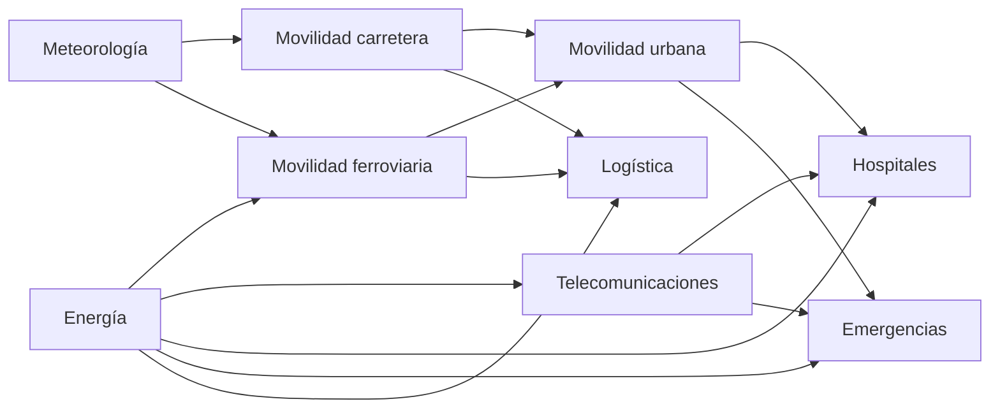

# Diseño y desarrollo de un sistema de análisis de amenazas operativas en servicios esenciales mediante Edge Computing y fusión de datos heterogéneos

Este repositorio contiene la implementación práctica de un Trabajo Fin de Grado centrado en el diseño y desarrollo de una arquitectura **Edge--Fog--Cloud** para la monitorización de servicios esenciales urbanos, la fusión temporal de datos heterogéneos, la detección híbrida de anomalías y el análisis de propagación de riesgos mediante grafos de dependencias.

El sistema se aplica al caso de estudio de la **Ciudad de Madrid**, integrando información procedente de fuentes públicas como **DGT**, **Renfe Cercanías**, **AEMET** y **Red Eléctrica de España (REE)**.

---

## Descripción general

El prototipo permite:

- Adquirir datos de distintas fuentes públicas.
- Publicar telemetría mediante MQTT.
- Fusionar observaciones heterogéneas en la capa Edge.
- Aplicar detección preliminar mediante reglas heurísticas.
- Ejecutar inferencia mediante un modelo de aprendizaje automático en la capa Fog.
- Analizar la criticidad mediante un grafo de dependencias entre servicios esenciales.
- Almacenar resultados en InfluxDB.
- Visualizar métricas y alertas mediante Grafana.
- Simular escenarios de riesgo mediante una aplicación interactiva basada en grafos.

La arquitectura se organiza en tres capas principales:

- **Edge**: adquisición, validación, fusión temporal y detección preliminar.
- **Fog**: inferencia, fusión de decisión, análisis de criticidad y persistencia operacional.
- **Cloud**: histórico de observaciones y reentrenamiento periódico del modelo.

---

## Arquitectura del sistema

```mermaid
graph TD
    subgraph Fuentes de datos
        DGT[DGT / Tráfico] --> Broker[Broker MQTT - Mosquitto]
        RENFE[Renfe / Cercanías] --> Broker
        AEMET[AEMET / Meteorología] --> Broker
        REE[REE / Energía] --> Broker
    end

    subgraph Edge
        Broker --> EdgeNode[edge/main.py]
        EdgeNode --> Fusion[TelemetryFusionBuffer]
        EdgeNode --> Rules[Detector basado en reglas]
        EdgeNode --> Broker
    end

    subgraph Fog
        Broker --> FogNode[fog/main.py]
        FogNode --> ML[RandomForestRegressor]
        FogNode --> Decision[Fusión reglas + ML]
        FogNode --> Graph[Grafo de dependencias]
        Decision --> Influx[(InfluxDB)]
        Graph --> State[latest_graph_state.json]
    end

    subgraph Cloud
        CSV[(data/fused_clean.csv)] --> Training[cloud/continuous_training.py]
        Training --> Model[models/latest_model.joblib]
        Model --> ML
    end

    subgraph Visualización
        Influx --> Grafana[Grafana]
        State --> Streamlit[Streamlit Graph App]
    end
````

---

## Estructura del proyecto

```text
.
├── cloud/
│   ├── continuous_training.py
│   ├── training/
│   │   └── train_model.py
│   └── model_registry/
│       └── registry.py
│
├── data/
│   ├── fused_observations.csv
│   ├── fused_clean.csv
│   └── latest_graph_state.json
│
├── edge/
│   ├── main.py
│   ├── telemetry_fusion.py
│   ├── detector.py
│   └── fused_storage.py
│
├── fog/
│   ├── main.py
│   └── services/
│       ├── inference.py
│       ├── decision_fusion.py
│       └── influx_writer.py
│
├── models/
│   ├── latest_model.joblib
│   └── metadata.json
│
├── mqtt_bridge/
│   └── publisher.py
│
├── shared/
│   ├── config.py
│   ├── schemas.py
│   └── critical_infra.py
│
├── visualization/
│   └── graph_propagation_app.py
│
├── docker-compose.yml
├── requirements.txt
└── README.md
```

---

## Componentes principales

### Capa Edge

La capa Edge recibe la telemetría publicada en MQTT, valida los mensajes, agrupa las observaciones recientes y genera una observación fusionada.

Componentes principales:

* `edge/main.py`: nodo principal de la capa Edge.
* `edge/telemetry_fusion.py`: buffer de fusión temporal de datos.
* `edge/detector.py`: detección preliminar basada en reglas heurísticas.
* `edge/fused_storage.py`: almacenamiento local de observaciones fusionadas.

Esta capa permite combinar datos rápidos de movilidad, como DGT y Renfe, con fuentes contextuales de actualización más lenta, como AEMET y REE.

---

### Capa Fog

La capa Fog consume las observaciones fusionadas generadas por el Edge y realiza el análisis principal del sistema.

Componentes principales:

* `fog/main.py`: nodo principal de la capa Fog.
* `fog/services/inference.py`: carga y ejecución del modelo de aprendizaje automático.
* `fog/services/decision_fusion.py`: combinación entre reglas heurísticas y modelo ML.
* `fog/services/influx_writer.py`: escritura de resultados en InfluxDB.
* `shared/critical_infra.py`: análisis de criticidad mediante grafo de dependencias.

La decisión final combina el score basado en reglas y el score estimado por el modelo:

```text
final_score = 0.60 * rule_score + 0.40 * ml_score
```

---

### Capa Cloud

La capa Cloud se encarga de gestionar el histórico de observaciones y de realizar el reentrenamiento periódico del modelo.

Componentes principales:

* `cloud/continuous_training.py`: supervisa el histórico de datos y lanza el reentrenamiento cuando existen suficientes muestras nuevas.
* `cloud/training/train_model.py`: entrena un modelo `RandomForestRegressor`.
* `cloud/model_registry/registry.py`: guarda el modelo entrenado y sus metadatos.

El modelo se almacena como:

```text
models/latest_model.joblib
```

---

### Visualización

El sistema incorpora dos mecanismos de visualización:

* **Grafana**: dashboard operacional para visualizar scores, anomalías, severidad, telemetría de entrada y decisiones recientes.
* **Streamlit + NetworkX + PyVis**: aplicación interactiva para analizar el grafo de dependencias y simular escenarios de propagación de riesgo.

La aplicación del grafo se ejecuta con:

```bash
streamlit run visualization/graph_propagation_app.py
```

---

## Grafo de dependencias

El sistema modela las relaciones funcionales entre distintos servicios esenciales mediante un grafo dirigido.

Servicios representados:

* Energía
* Meteorología
* Movilidad por carretera
* Movilidad ferroviaria
* Movilidad urbana
* Telecomunicaciones
* Hospitales
* Emergencias
* Logística

Ejemplo simplificado:



El grafo permite estimar:

* Riesgo propio de cada nodo.
* Riesgo propagado desde nodos dependientes.
* Riesgo final por servicio.
* Score global del grafo.
* Índice de criticidad.
* Nodo dominante de la perturbación.

---

## Requisitos

### Software necesario

* Python 3.9 o superior
* Docker
* Docker Compose
* Git

### Servicios desplegados con Docker

El archivo `docker-compose.yml` levanta los siguientes servicios:

* Mosquitto MQTT Broker
* InfluxDB v2
* Grafana

---

## Instalación

Clonar el repositorio:

```bash
git clone https://github.com/tu-usuario/tu-repositorio.git
cd tu-repositorio
```

Crear y activar un entorno virtual:

```bash
python -m venv venv
```

En Linux/macOS:

```bash
source venv/bin/activate
```

En Windows:

```bash
venv\Scripts\activate
```

Instalar dependencias:

```bash
pip install -r requirements.txt
```

---

## Configuración

Crear un archivo `.env` en la raíz del proyecto:

```env
AEMET_API_KEY=tu_api_key_aqui

MQTT_BROKER=localhost
MQTT_PORT=1883

INFLUXDB_URL=http://localhost:8086
INFLUXDB_TOKEN=tfg-token
INFLUXDB_ORG=tfg
INFLUXDB_BUCKET=fog_data
```

> Nota: los nombres exactos de las variables pueden adaptarse a la configuración definida en `shared/config.py`.

---

## Puesta en marcha

### 1. Levantar la infraestructura

```bash
docker compose up -d
```

Servicios disponibles:

* MQTT Broker: `localhost:1883`
* InfluxDB: `http://localhost:8086`
* Grafana: `http://localhost:3000`

---

### 2. Lanzar el nodo Edge

```bash
python -m edge.main
```

El nodo Edge consume telemetría, realiza la fusión temporal y publica observaciones fusionadas.

---

### 3. Lanzar el nodo Fog

```bash
python -m fog.main
```

El nodo Fog consume observaciones fusionadas, ejecuta inferencia, calcula criticidad y escribe resultados en InfluxDB.

---
### 5. Lanzar los clientes

```bash
python -m data_sources.ree_client
python -m data_sources.aemet_client   
python -m data_sources.renfe_client
python -m data_sources.dgt_client   
```

Este módulo publica en MQTT los datos procedentes de las fuentes configuradas.

---

### 6. Lanzar el servicio Cloud

```bash
python -m cloud.continuous_training
```

Este proceso supervisa el histórico de observaciones y ejecuta el reentrenamiento periódico del modelo cuando se cumplen las condiciones definidas.

---

### 7. Lanzar la aplicación interactiva del grafo

```bash
streamlit run visualization/graph_propagation_app.py
```

---
### 8. Lanzar Telemetría Sintética

```bash
python mqtt_bridge/test_publish_ree.py
python mqtt_bridge/test_publish_aemet.py  
python mqtt_bridge/test_publish_renfe.py  
python mqtt_bridge/test_publish_dgt.py  
```

---

## Topics MQTT principales

| Topic                     | Descripción                                 |
| ------------------------- | ------------------------------------------- |
| `telemetry/dgt`           | Telemetría de incidencias de tráfico        |
| `telemetry/renfe`         | Telemetría ferroviaria                      |
| `telemetry/aemet`         | Telemetría meteorológica                    |
| `telemetry/ree`           | Telemetría energética                       |
| `edge/fused_observations` | Observaciones fusionadas generadas por Edge |
| `alerts/anomaly`          | Alertas preliminares generadas por reglas   |
| `alerts/final`            | Decisiones finales generadas por Fog        |

---

## Modelo de aprendizaje automático

El sistema utiliza un modelo `RandomForestRegressor` para estimar el score de riesgo a partir de las variables fusionadas.

El modelo se entrena a partir del histórico de observaciones limpias almacenado en:

```text
data/fused_clean.csv
```

Las métricas principales utilizadas durante la evaluación son:

* MAE
* RMSE
* R²

Si no existe un modelo disponible, la capa Fog puede continuar funcionando en modo de contingencia utilizando únicamente la salida basada en reglas.

---

## Simulación de escenarios

El sistema permite simular escenarios de riesgo mediante mensajes MQTT sintéticos y mediante la aplicación interactiva del grafo.

Escenarios considerados:

* Anomalía en movilidad.
* Perturbación energética.
* Condiciones meteorológicas adversas.

Estos escenarios no representan predicciones exactas de incidentes reales, sino casos de prueba controlados para comprobar el comportamiento funcional del sistema.

---

## Dashboard de Grafana

Grafana permite visualizar:

* Score basado en reglas.
* Score estimado por el modelo.
* Score final consolidado.
* Estado de anomalía.
* Severidad.
* Nodo dominante.
* Score global del grafo.
* Índice de criticidad.
* Telemetría de entrada.
* Decisiones recientes.

---

## Tecnologías utilizadas

* Python
* MQTT / Mosquitto
* Docker / Docker Compose
* InfluxDB
* Grafana
* Streamlit
* NetworkX
* PyVis
* Pandas
* NumPy
* Scikit-learn
* Joblib
* Pydantic

---

## Limitaciones

Este proyecto es un prototipo académico ejecutado en un entorno local controlado. Por tanto, no incluye todos los elementos necesarios para un despliegue en producción, como alta disponibilidad, autenticación avanzada, tolerancia a fallos, balanceo de carga o monitorización distribuida real.

Además, algunos escenarios son sintéticos y están diseñados para comprobar el funcionamiento del sistema, no para realizar predicciones probabilísticas de incidentes reales.

---

## Autor

**Alejandro García Ramírez**
Trabajo Fin de Grado
Grado en Ingeniería de Tecnologías y Servicios de Telecomunicación
Universidad Politécnica de Madrid
