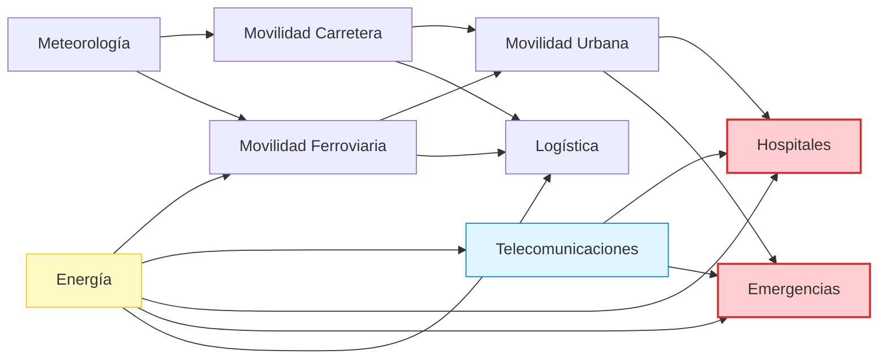

# Sistema de Monitoreo IoT de Múltiples Fuentes, Fusión Temporal y Detección de Anomalías con Propagación en Grafos para Infraestructuras Críticas

Este repositorio contiene la implementación práctica del **Trabajo de Fin de Grado (TFG)** centrado en el desarrollo de una arquitectura de computación en tres niveles (Edge-Fog-Cloud) para la monitorización de fuentes IoT heterogéneas, fusión temporal de telemetrías, detección híbrida de anomalías y simulación de la propagación de riesgos en grafos de dependencias para infraestructuras críticas.

---

## 1. Descripción General de la Arquitectura

El sistema implementa una topología de procesamiento jerárquico dividida en tres capas principales (**Edge, Fog, Cloud**), junto con un simulador de sensores y un cuadro de mando interactivo:

```mermaid
graph TD
    %% Fuentes de Datos y Simulación
    subgraph Fuentes de Datos (MQTT Bridge)
        AEMET[AEMET API / Clima] -->|MQTT| Broker[Broker MQTT - Mosquitto]
        REE[REE API / Red Eléctrica] -->|MQTT| Broker
        DGT[DGT NAP / Tráfico] -->|MQTT| Broker
        RENFE[RENFE GTFS-RT / Trenes] -->|MQTT| Broker
    end

    %% Capa Edge
    subgraph Capa Edge (Borde)
        Broker -->|Suscripción| Edge[edge/main.py]
        Edge -->|Fusión Temporal| Buffer[TelemetryFusionBuffer]
        Edge -->|Detección por Reglas| BaseDet[Rule-based Detector]
        Edge -->|Observación Fusionada y Alertas| Broker
    end

    %% Capa Fog
    subgraph Capa Fog (Niebla)
        Broker -->|Suscripción| Fog[fog/main.py]
        Fog -->|Inferencia ML| RandomForest[RandomForestRegressor]
        Fog -->|Fusión de Decisión| Decision[fuse_rule_and_ml]
        Fog -->|Propagación en Grafo| GraphEngine[shared/critical_infra.py]
        
        %% Persistencia
        Decision -->|Escritura| Influx[(InfluxDB)]
        GraphEngine -->|Estado en Tiempo Real| JSONState[latest_graph_state.json]
    end

    %% Capa Cloud
    subgraph Capa Cloud (Nube)
        CSVData[(data/fused_clean.csv)] -->|Monitoreo| Cloud[cloud/continuous_training.py]
        Cloud -->|Reentrenamiento Auto| CloudTrain[cloud/training/train_model.py]
        CloudTrain -->|Guardar Modelo| Registry[Model Registry]
        Registry -->|latest_model.joblib| RandomForest
    end

    %% Visualización
    subgraph Visualización
        JSONState -->|Lectura| StreamlitApp[visualization/graph_propagation_app.py]
        Influx -->|Dashboard| Grafana[Grafana Dashboard]
    end

    classDef edgeStyle fill:#e1f5fe,stroke:#0288d1,stroke-width:2px;
    classDef fogStyle fill:#efebe9,stroke:#5d4037,stroke-width:2px;
    classDef cloudStyle fill:#ede7f6,stroke:#5e35b1,stroke-width:2px;
    classDef sourceStyle fill:#e8f5e9,stroke:#388e3c,stroke-width:2px;
    classDef visStyle fill:#fff8e1,stroke:#ffa000,stroke-width:2px;
    
    class Edge,Buffer,BaseDet edgeStyle;
    class Fog,RandomForest,Decision,GraphEngine,Influx,JSONState fogStyle;
    class Cloud,CloudTrain,Registry,CSVData cloudStyle;
    class AEMET,REE,DGT,RENFE,Broker sourceStyle;
    class StreamlitApp,Grafana visStyle;
```

---

## 2. Descripción de las Capas y Componentes

### 2.1 Capa Edge (`edge/`)
* **`telemetry_fusion.py`**: Implementa un buffer de alineación temporal (`TelemetryFusionBuffer`). Permite unificar eventos de transporte de alta frecuencia (DGT, RENFE) con datos meteorológicos (AEMET) y del sector eléctrico (REE) que tienen mayores tiempos de actualización, controlando la validez de los datos mediante un delta temporal ajustable (definido en $3600$ segundos).
* **`detector.py`**: Realiza una detección de anomalías preliminar basada en reglas fijas sobre los contadores e incidencias agregadas, arrojando una primera métrica de criticidad y publicando una alerta local en el topic `alerts/anomaly` si los umbrales son superados.
* **`fused_storage.py`**: Almacena las observaciones fusionadas localmente en `data/fused_observations.csv` de forma selectiva para evitar redundancia de datos duplicados y optimizar espacio.

### 2.2 Capa Fog (`fog/`)
* **`main.py`**: Consume las observaciones del Edge, ejecuta inferencia de Machine Learning, procesa el grafo de infraestructuras críticas y escribe en InfluxDB.
* **`services/inference.py`**: Carga el modelo RandomForestRegressor entrenado en la nube. Si no existe ningún modelo disponible aún, entra en modo de contingencia ejecutando lógica basada únicamente en reglas.
* **`services/decision_fusion.py`**: Combina la salida del detector del Edge (reglas) y la inferencia del modelo (ML) mediante una ponderación híbrida:
  $$\text{Score Final} = (0.6 \times \text{Score Reglas}) + (0.4 \times \text{Score ML})$$
* **`services/influx_writer.py`**: Escribe las métricas finales (anomalías, scores, variables meteorológicas, de transporte y eléctricas) en **InfluxDB** bajo la medición `anomalies`.

### 2.3 Capa Cloud (`cloud/`)
* **`continuous_training.py`**: Monitoriza en segundo plano el archivo de datos históricos (`fused_clean.csv`). Si se detectan más de $30$ nuevas observaciones desde el último entrenamiento, activa automáticamente el pipeline de reentrenamiento.
* **`training/train_model.py`**: Entrena un modelo **RandomForestRegressor** (200 estimadores, profundidad máxima 10) usando como etiquetas el score de anomalía calculado históricamente, evaluando métricas como MAE, RMSE y $R^2$.
* **`model_registry/registry.py`**: Gestiona el almacenamiento de modelos guardándolos en `models/latest_model.joblib` junto con sus metadatos (features utilizadas, puntuaciones del modelo, fecha de entrenamiento, etc.) en `metadata.json`.

### 2.4 Visualización (`visualization/`)
* **`graph_propagation_app.py`**: Aplicación web interactiva desarrollada en **Streamlit** que utiliza **NetworkX** y **PyVis** para representar y animar en tiempo real el flujo de propagación de fallos dentro de la red de infraestructuras críticas. Permite simular escenarios teóricos y ver el estado real consumido de `data/latest_graph_state.json`.

---

## 3. Lógica del Grafo de Dependencias e Infraestructuras Críticas

El modelo representa la interdependencia entre 9 sectores clave:



### 3.1 Fórmula de Propagación
El riesgo o estado de fallo intrínseco de cada nodo ($state\_score$) se calcula según las telemetrías del sistema (p. ej., número de incidentes de DGT para carretera, generación eléctrica para energía, etc.). 

Si un nodo depende de otros, hereda su riesgo de forma atenuada:
$$\text{Riesgo Heredado} = \frac{1}{|D|} \sum_{d \in D} \text{Score Final}_d$$

El **Score Final** de cada nodo tras propagar el impacto se define como:
$$\text{Score Final} = \text{clamp}(0.70 \times \text{Score Propio} + 0.30 \times (0.55 \times \text{Riesgo Heredado}))$$

### 3.2 Métricas Globales
* **Score de Grafo Global (`graph_score`):** Suma ponderada según los pesos base de cada nodo:
  $$\text{Global Score} = \frac{\sum (w_i \times \text{Score Final}_i)}{\sum w_i}$$
* **Score de Criticidad (`criticality_score`):** Nivel de riesgo promedio de los tres nodos más críticos del sistema: Hospitales, Emergencias y Telecomunicaciones.
* **Nodo Dominante (`dominant_node`):** Aquel nodo con el score final más elevado en la propagación, indicando la raíz principal de impacto en el ecosistema.

---

## 4. Requisitos e Instalación

### 4.1 Requisitos de Software
* Python 3.9 o superior
* Docker y Docker Compose (para Mosquitto, InfluxDB y Grafana)

### 4.2 Instalación de Dependencias Python
Instala todas las librerías necesarias con el archivo `requirements.txt`:
```bash
pip install -r requirements.txt
```

---

## 5. Puesta en Marcha del Sistema

### Paso 1: Levantar la Infraestructura Docker
Inicia el broker de mensajería MQTT (Mosquitto) y las bases de datos:
```bash
docker compose up -d
```
Esto levantará:
* **MQTT Broker (Mosquitto)** en el puerto `1883`
* **InfluxDB v2** en el puerto `8086` (Org: `tfg`, Bucket: `fog_data`, Token: `tfg-token`)
* **Grafana** en el puerto `3000`

### Paso 2: Crear el archivo `.env`
Crea un archivo `.env` en la raíz del proyecto para definir tu clave de la API de AEMET:
```env
AEMET_API_KEY=tu_api_key_aqui
```

### Paso 3: Lanzar los Servicios
Para ejecutar el sistema completo en tiempo real, ejecuta cada uno de los siguientes scripts en terminales independientes:

1. **Lanzar el Puente MQTT / Publicador de Telemetría (Simulador):**
   *Este servicio simula el envío periódico de datos obtenidos de las APIs reales hacia MQTT.*
   ```bash
   python -m mqtt_bridge.publisher
   ```

2. **Lanzar el Nodo Edge:**
   *Recibe datos raw, gestiona el buffer temporal y publica observaciones fusionadas.*
   ```bash
   python -m edge.main
   ```

3. **Lanzar el Nodo Fog:**
   *Consume observaciones, ejecuta ML, propaga riesgos en el grafo y escribe en InfluxDB.*
   ```bash
   python -m fog.main
   ```

4. **Lanzar el Servicio de Entrenamiento en la Nube (Cloud):**
   *Supervisa el crecimiento del CSV de datos limpios y reentrena el modelo RandomForest.*
   ```bash
   python -m cloud.continuous_training
   ```

5. **Lanzar el Dashboard de Visualización (Streamlit):**
   *Abre el panel interactivo del grafo de propagación en tu navegador.*
   ```bash
   streamlit run visualization/graph_propagation_app.py
   ```
